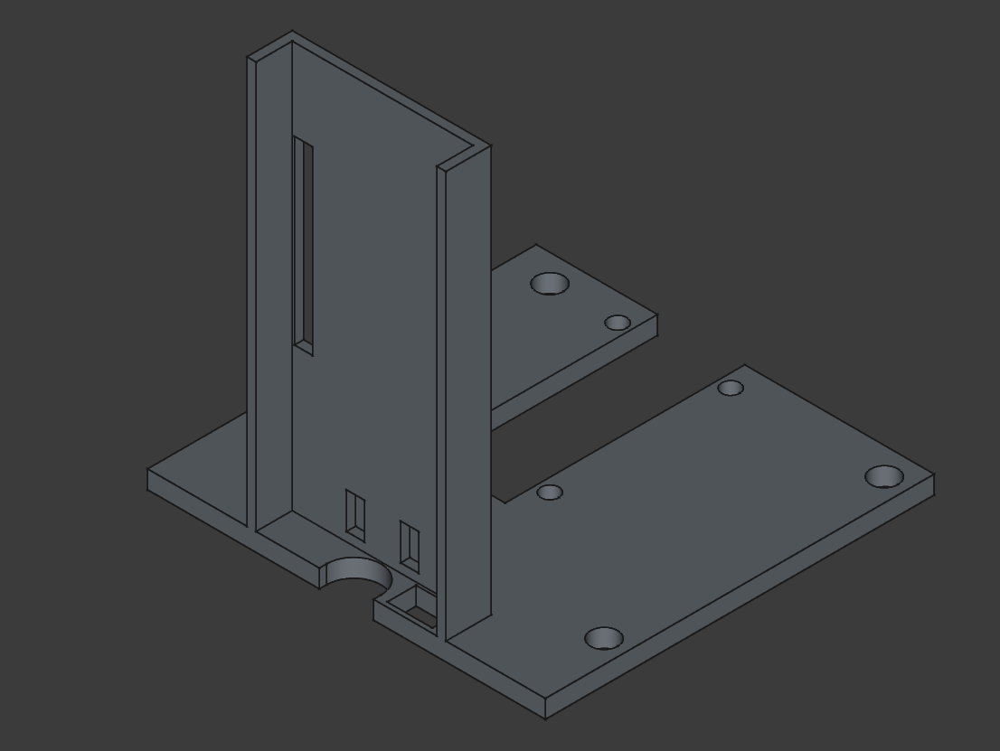
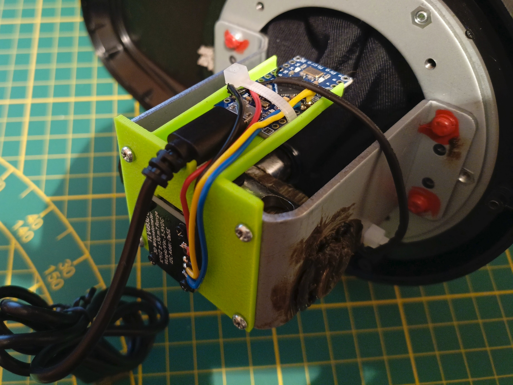

# Arduino TH8A Shifter Mod
Revive broken Thrustmaster TH8A shifter using Arduino and 3-axis magnetometer TLV493D module.

## Requirements
 - Arduino with USB HID capabilites, for this project Pro Micro is best suited due to small footprint
 - 3-axis magnetometer TLV493D
 - 3D printer to print custom Arduino mount
 - 4 threading screws to mount magnetometer

## Wiring
Wiring between TLV493D and Ardunio:
 - Vin -> VCC
 - GND -> GND
 - SCL -> pin 3 (SCL)
 - SDA -> pin 2 (SDA)

Wiring between TH8A pushbutton and Arduino:
 - One end should be connected to ground, and the other to pin 15 configured as pull-up.

## Code
Depending on your module, polar and azimuth values might differ, because of this, between lines 95 and 100 there is commented code which you can use to find perfect values and modify gears mapping accordingly.

For compatibility with older games, shifter gears are registerd as keyboard inputs, not as game controller buttons. Gears are coresponding to 1-8 keys in H-mode, and to +/- signs in sequential mode.

## STL Model
To mount Arduino and magnetometer, we need to print custom mount, located in 'assets/stl_part.stl' folder in repo.

## Assembly
Finished assembly using 4 screws from shifter and addidtional 4 threading screws to mount megnetometer module.

## HID Device Name
Normally your device will display as a generic Arduino, you can use instructions [from this issue](https://github.com/NicoHood/HID/issues/125) to modify its name. For example mine is registered as 'Arduino SA TH8A Shifter'.